# hello mermaid
use previm

REF: knsv.github.io/mermaid

---
**sequenceDiagram2**
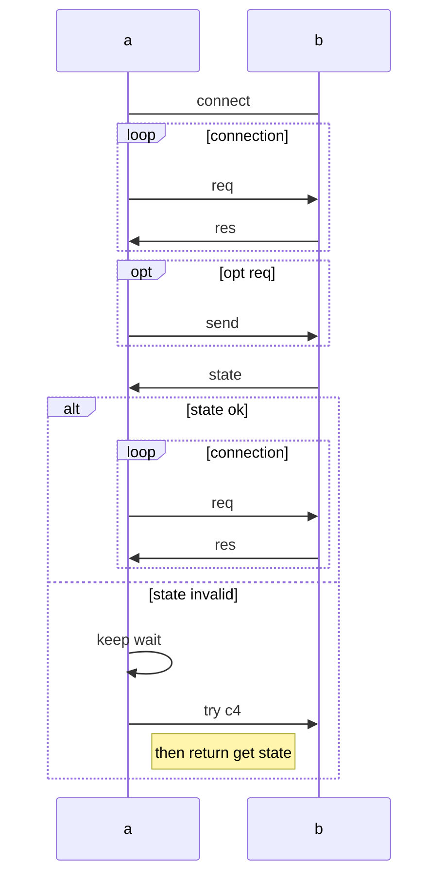

---
**subgraph**
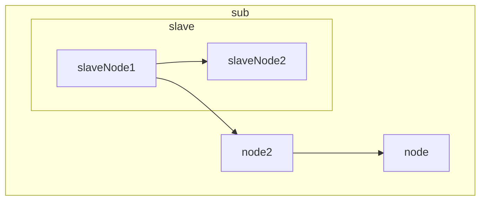

---
**line and subgraph**
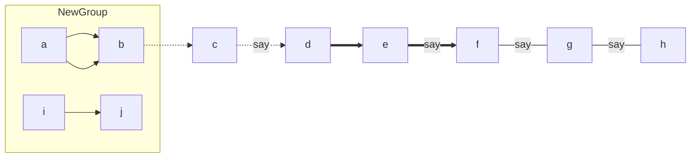

---
**gantt**
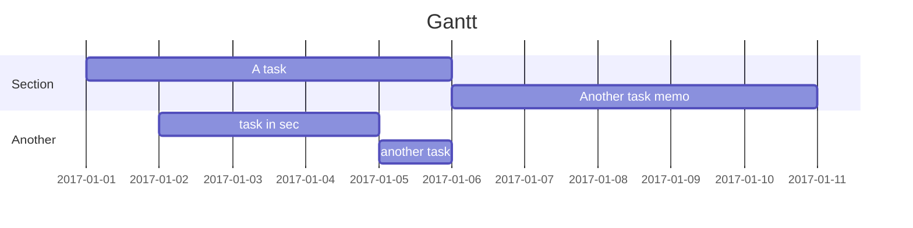

---
**node**
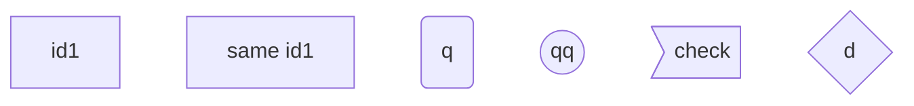

---
**TB**
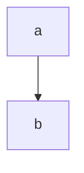

**BT**
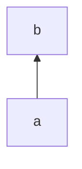

**RL**
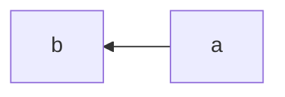

**LR**
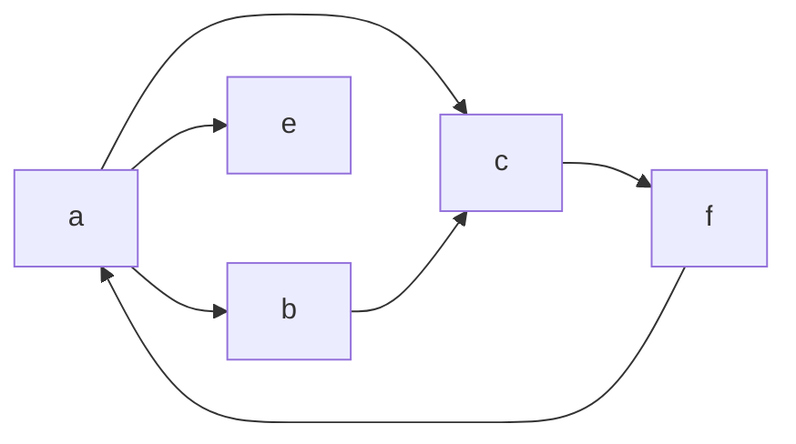

---
**sequence**
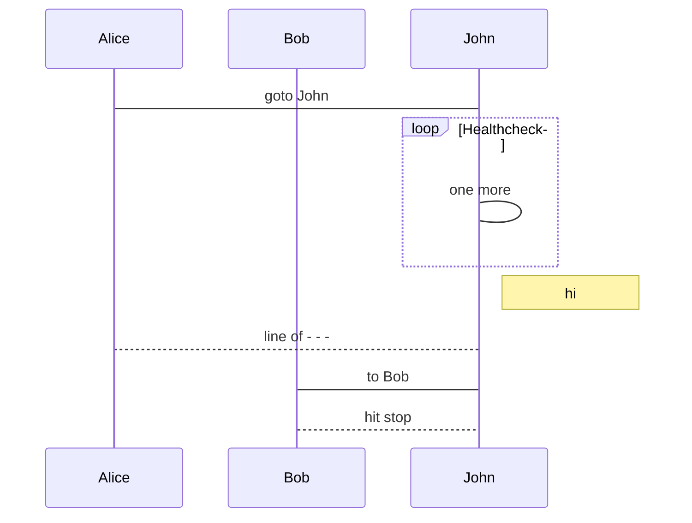

---
**hello mermaid!**
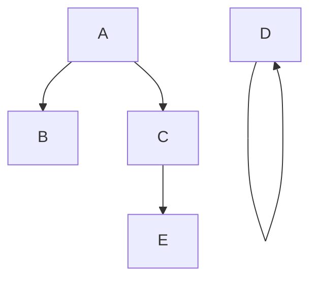
