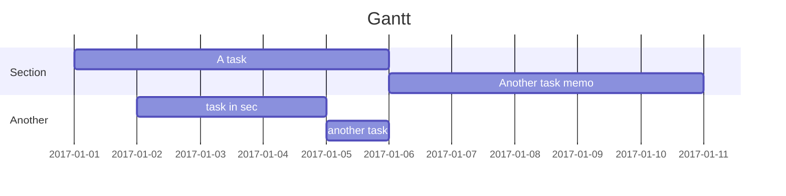
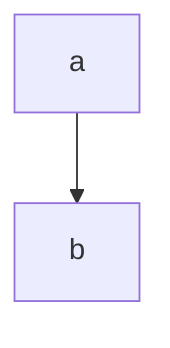
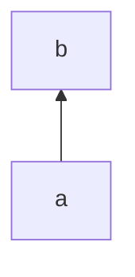
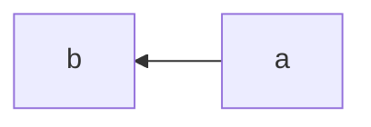
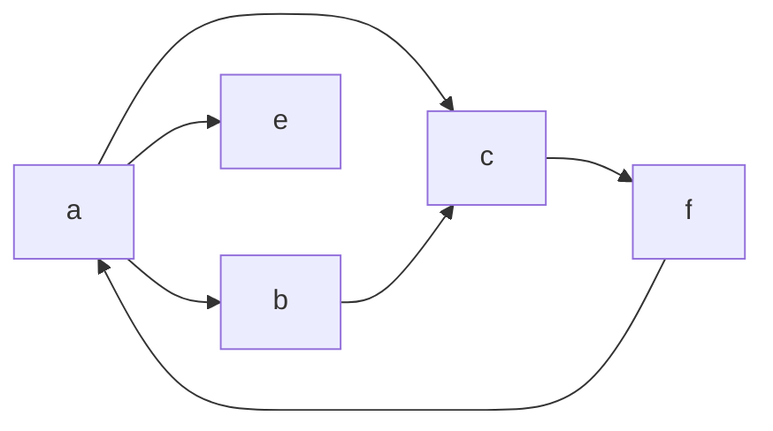
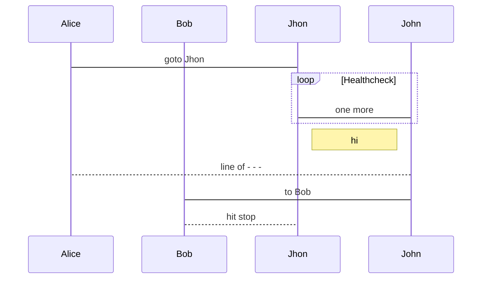
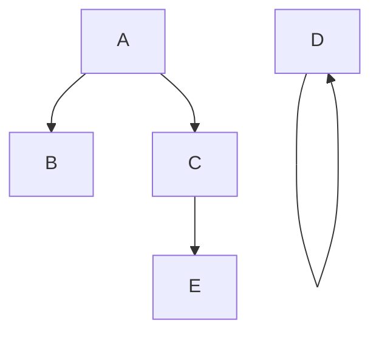

# hello mermaid
use previm

---

```mermaid
gantt
  title Gantt

  section Section
  A task :a1, 2017-01-01, 5d
  Another task memo: after a1, 5d
  section Another
  task in sec :2017-01-02, 3d
  another task :1d
```

---
style

```mermaid
graph TB
  id1
  id2[same id1]
  id3(q)
  id4((qq))
  id5>check]
  id6{d}
```

```mermaid
graph TB
  a --> b
```

```mermaid
graph BT
  a --> b
```

```mermaid
graph RL
  a --> b
```

```mermaid
graph LR
  a --> b
  a --> c
  a --> e

  b --> c
  c --> f
  f --> a
```

---

```mermaid
sequenceDiagram
  participant Alice
  participant Bob
  Alice -> Jhon: goto Jhon
  loop Healthcheck
    Jhon -> John: one more
  end
  Note right of Jhon: hi
  John --> Alice: line of - - -
  John -> Bob: to Bob
  Bob --> Jhon: hit stop
```

---
hello mermaid!

```mermaid
graph TD;
  A --> B;
  A --> C;
  D --> D;
  C --> E;
```
