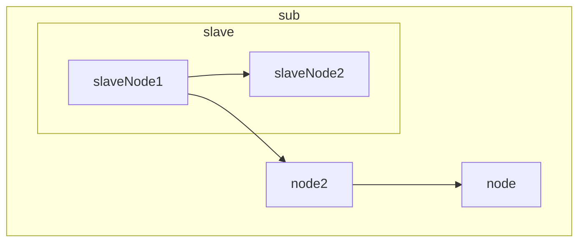
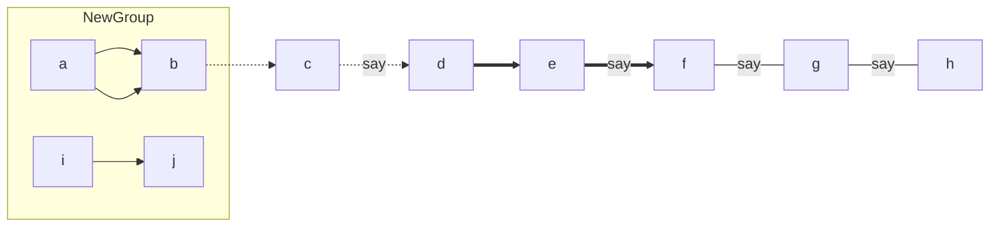
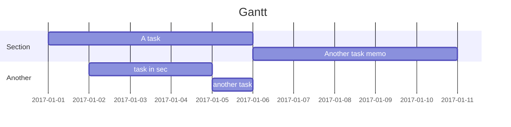
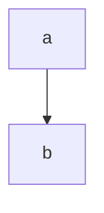
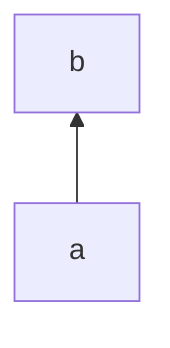
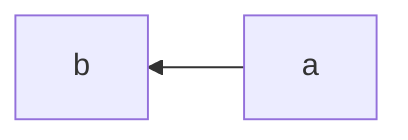
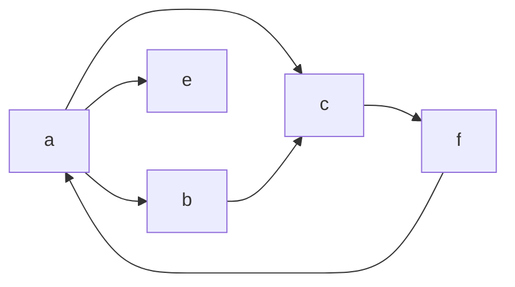
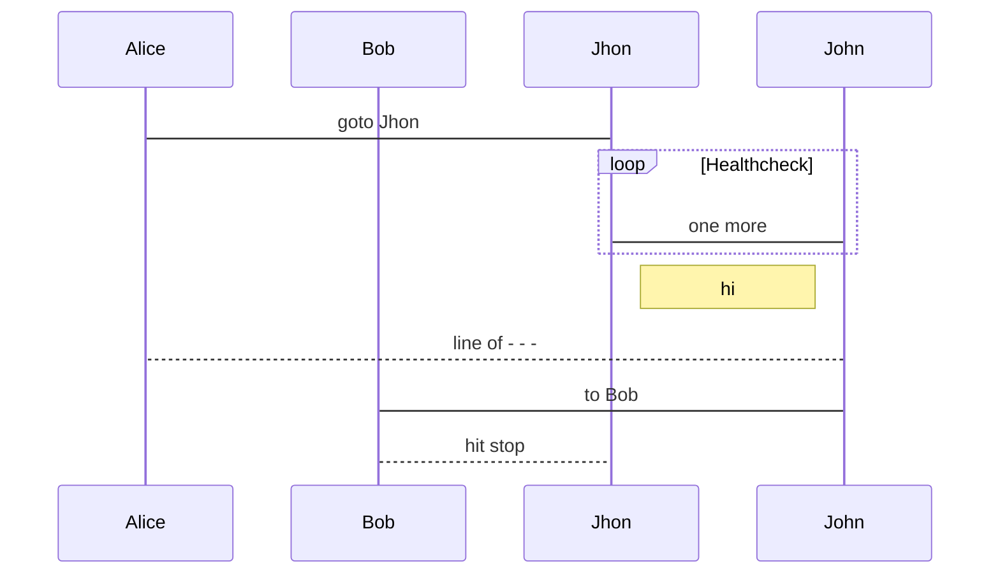
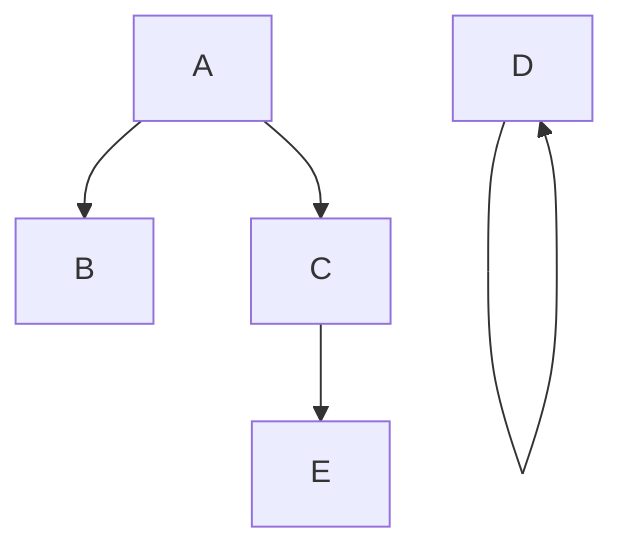

# hello mermaid
use previm

---
**subgraph**

```mermaid
graph TD
subgraph sub
  node
  subgraph slave
    slaveNode1
    slaveNode2
  end
end
subgraph sub
  node2
end

slaveNode1 --> slaveNode2
node2 --> node
slaveNode1 --> node2
```

---
**line and subgraph**

```mermaid
%% comment
graph LR
  a --> b
  b -.-> c
  c -. say .-> d
  d ==> e
  e == say ==> f
  f -- say --- g
  g ---| say |h;

subgraph NewGroup
  a --> b
  i --> j
end
```

---
**gantt**

```mermaid
gantt
  title Gantt

  section Section
  A task :a1, 2017-01-01, 5d
  Another task memo: after a1, 5d
  section Another
  task in sec :2017-01-02, 3d
  another task :1d
```

---
**node**

```mermaid
graph TB
  id1
  id2[same id1]
  id3(q)
  id4((qq))
  id5>check]
  id6{d}
```

---
**TB**

```mermaid
graph TB
  a --> b
```

**BT**

```mermaid
graph BT
  a --> b
```

**RL**

```mermaid
graph RL
  a --> b
```

**LR**

```mermaid
graph LR
  a --> b
  a --> c
  a --> e

  b --> c
  c --> f
  f --> a
```

---
**sequence**

```mermaid
sequenceDiagram
  participant Alice
  participant Bob
  Alice -> Jhon: goto Jhon
  loop Healthcheck
    Jhon -> John: one more
  end
  Note right of Jhon: hi
  John --> Alice: line of - - -
  John -> Bob: to Bob
  Bob --> Jhon: hit stop
```

---
**hello mermaid!**

```mermaid
%% comment
%% TD same TB(top to bottom)
graph TD;
  A --> B;
  A --> C;
  D --> D;
  C --> E;
```
